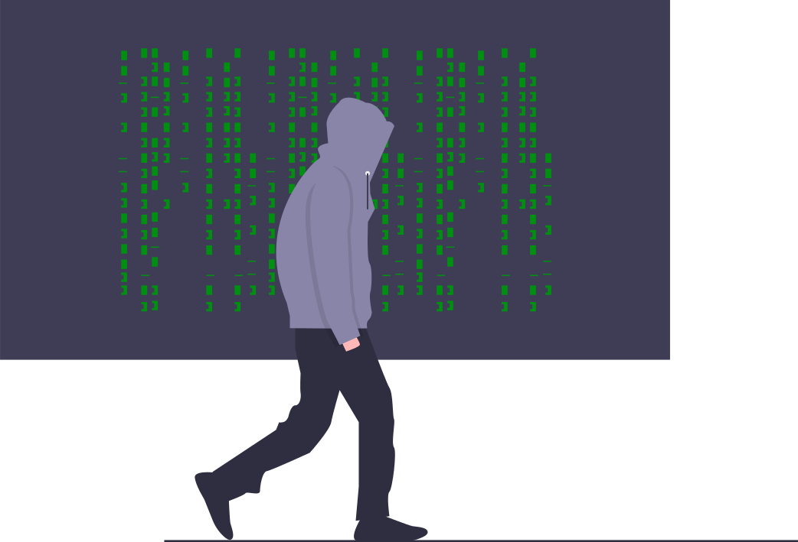
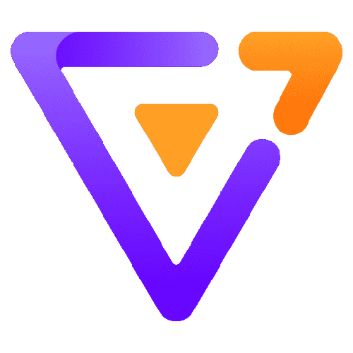

  

<h1 align="center">Hi, I'm HASAN 👋</h1>

<strong>Front-end Developer | JavaScript Enthusiast | Lifelong Learner</strong>

---

## 🚀 About Me

I'm a passionate and curious front-end developer who loves building intuitive and performant web interfaces. My journey began in 2021 with the basics — HTML, CSS, and JavaScript — and quickly evolved into a love for frameworks like React and Next.js. I enjoy taking on new challenges, learning modern tools, and improving UI/UX experiences.

---

## 🛠️ Skills & Tools

  
  
  
  
  
  
  
  
  
  
  
  
  
  
  
  
  
  

---

## 🧠 What I'm Learning

- 🧩 Mastering **Advanced React Patterns**
- 🌍 Exploring **Nuxt.js** and **Vue 3**
- 🔧 Deepening knowledge of **Testing** with **Jest** and **React Testing Library**
- 📦 Improving project structure and scalability

---

## 🔭 Current Projects

- 🧠 **Sudoku Game** – A fun brain teaser in React (open to contributions!)
- 📰 **Blog CMS** – Creating a content management system using Next.js
- 📊 **Dashboard UI Kit** – Building reusable dashboard components

---

## ✨ Featured Projects

| Project        | Description                           | Demo / Repo                              |
|----------------|---------------------------------------|------------------------------------------|
| Sudoku Game    | A playable Sudoku game in React       | [View](https://your-sudoku-link.com)     |
| React Projects | Mini React apps for learning purposes | [View](https://aall-react-projects.netlify.app/) |
| UI Kit         | Reusable UI components (in progress)  | _Coming Soon_                            |

---

## 🌐 Where to Find Me

  
  
  

---

✨ Keep Learning. Keep Building. Stay Curious. ✨

