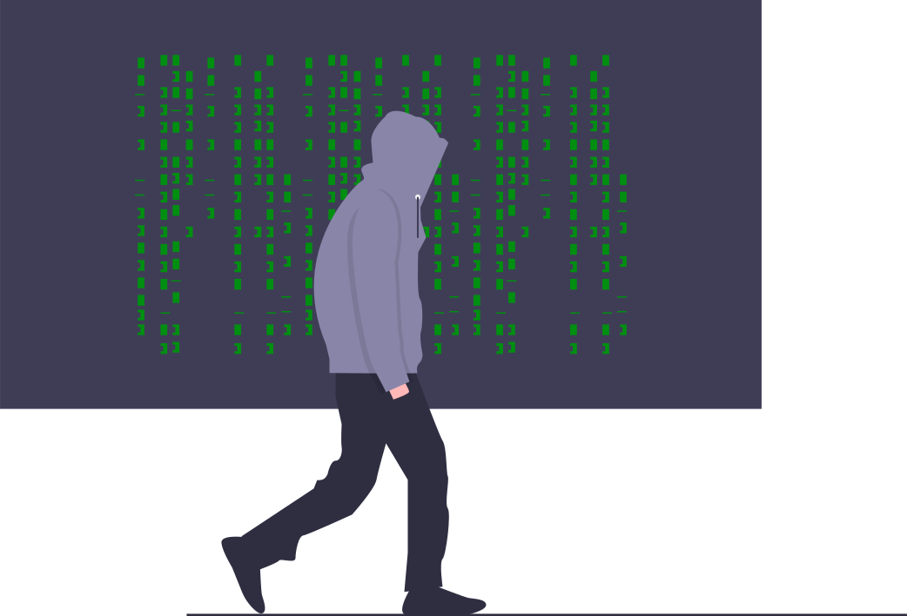
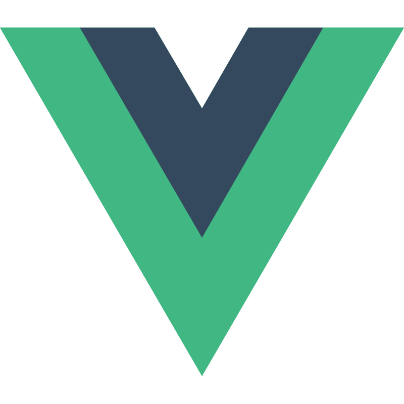
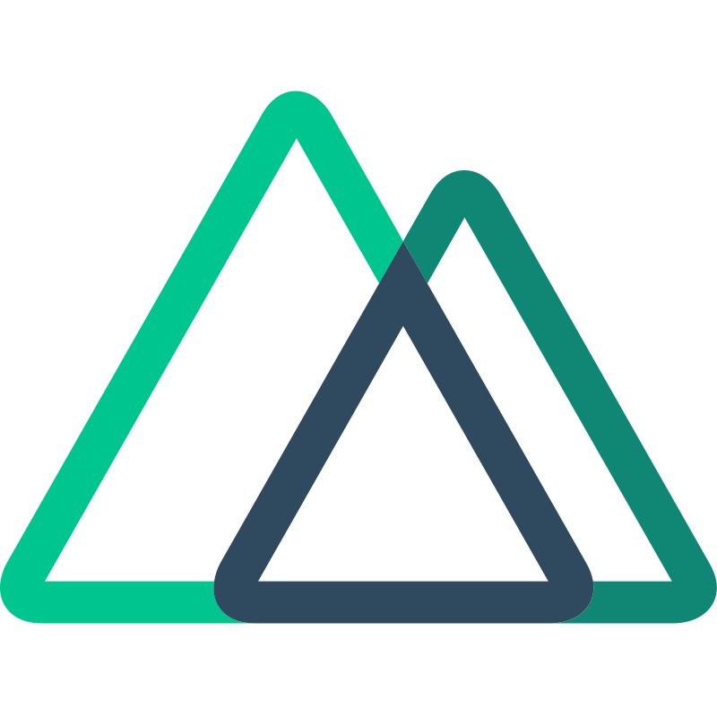
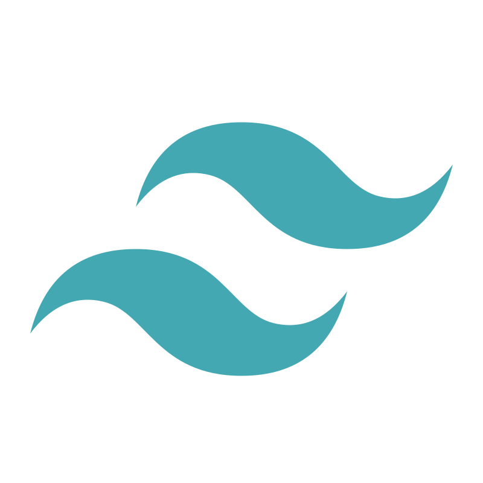
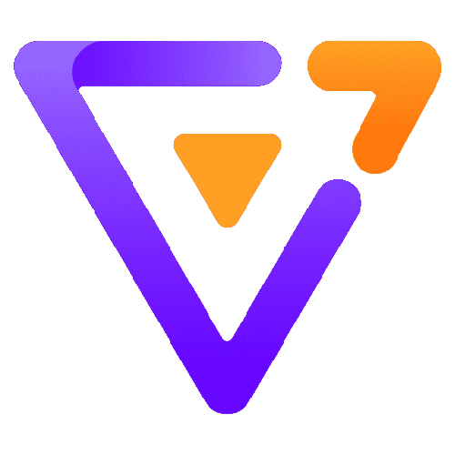
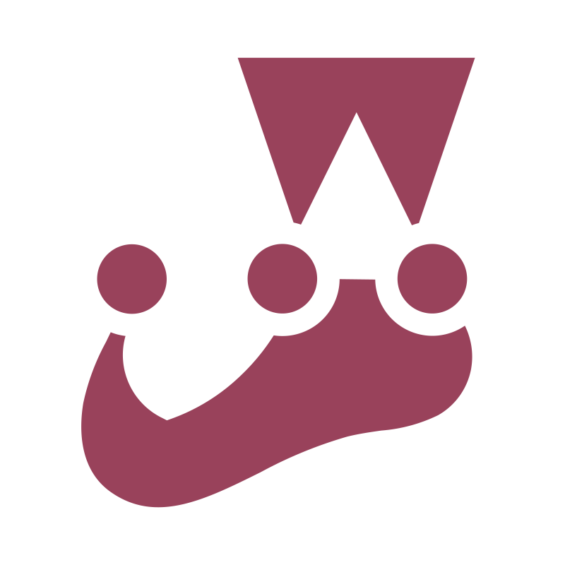
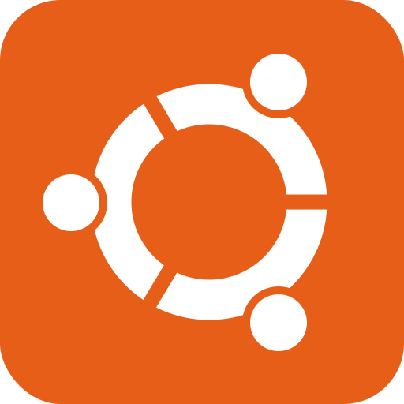

  

<h1 align="center">Hi, I'm Hasan 👋</h1>

  <em>Front-end Developer crafting fast, accessible, and beautifully engineered web experiences.</em>

  
  
  

---

## 👨‍💻 About Me

I'm a front-end developer focused on translating thoughtful design into production-ready interfaces. Since 2021, I've been building with the modern web — React, Next.js, Vue, and Nuxt — with a strong emphasis on **performance, accessibility, and developer experience**.

- 🧩 I care about clean architecture, reusable components, and type safety.
- 🎨 I bridge the gap between design intent and implementation detail.
- 📚 I learn in public and ship in private — always iterating.

---

## 🛠️ Tech Stack

**Languages**

  
  
  
  
  

**Frameworks & Libraries**

  
  
  
  

**Styling & UI**

  
  
  
  
  

**State Management**

  
  
  

**Testing & Tooling**

  
  
  
  
  
  

---

## 🌱 Currently Exploring

- **Type-safe state** patterns with Zustand and Pinia
- **Testing strategy** — unit (Jest), component (RTL), and E2E (Cypress)
- **Design systems** — building scalable component libraries
- **SSR & SSG** internals across Next.js and Nuxt

---

## ✨ Featured Projects

<table>
  <tr>
    <td width="50%" valign="top">
      <h3>🎯 Sudoku Game</h3>
      
A polished, fully playable Sudoku game with difficulty levels, timer, and clean state management — built with React and Emotion.

      

        <strong>Stack:</strong> React · Emotion · Vite 
        <a href="https://project-24-sudoku.netlify.app/"><strong>Live Demo →</strong></a>
      

    </td>
    <td width="50%" valign="top">
      <h3>📝 Blog CMS</h3>
      
A Markdown-driven blog platform with MDX support, dynamic routing, and a writer-friendly content workflow.

      

        <strong>Stack:</strong> Next.js · MDX · TypeScript 
        <em>In progress</em>
      

    </td>
  </tr>
  <tr>
    <td width="50%" valign="top">
      <h3>🧩 UI Kit</h3>
      
A reusable, themeable component system for dashboards and admin panels — accessibility-first and fully typed.

      

        <strong>Stack:</strong> React · TypeScript · Storybook 
        <em>In progress</em>
      

    </td>
    <td width="50%" valign="top">
      <h3>🚀 More Coming Soon</h3>
      
I'm always experimenting. Check the pinned repositories below for the latest work.

      

        <a href="https://github.com/Aghaei-Dev?tab=repositories"><strong>Browse all repos →</strong></a>
      

    </td>
  </tr>
</table>

---

## 📊 GitHub Stats

  
  

  

---

## 📫 Let's Connect

I'm always open to interesting projects, collaboration, and conversations about the craft.

  <a href="https://www.linkedin.com/in/Aghaei-Devv">LinkedIn</a> ·
  <a href="mailto:aghaei.dev@gmail.com">Email</a> ·
  <a href="https://t.me/Aghaei_Dev">Telegram</a>

---

  <em>Code with intent. Build with care. Ship with confidence.</em>

